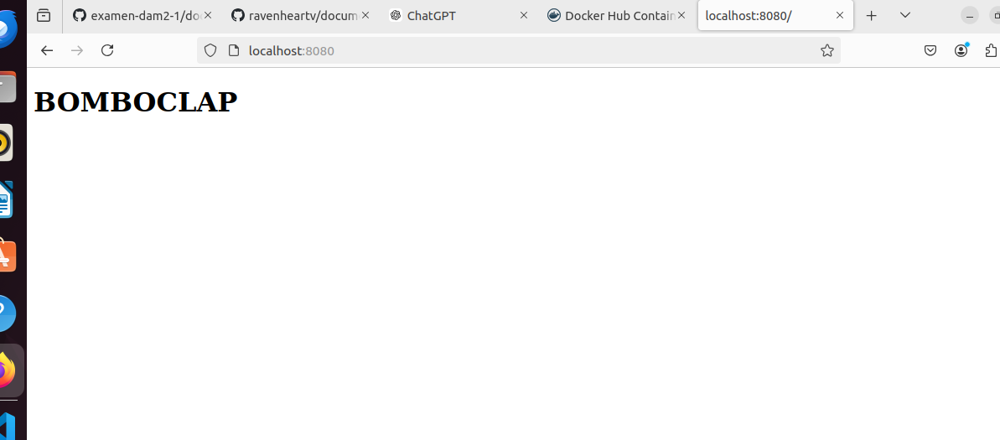
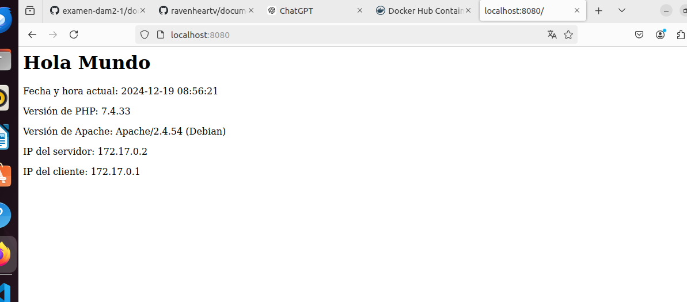
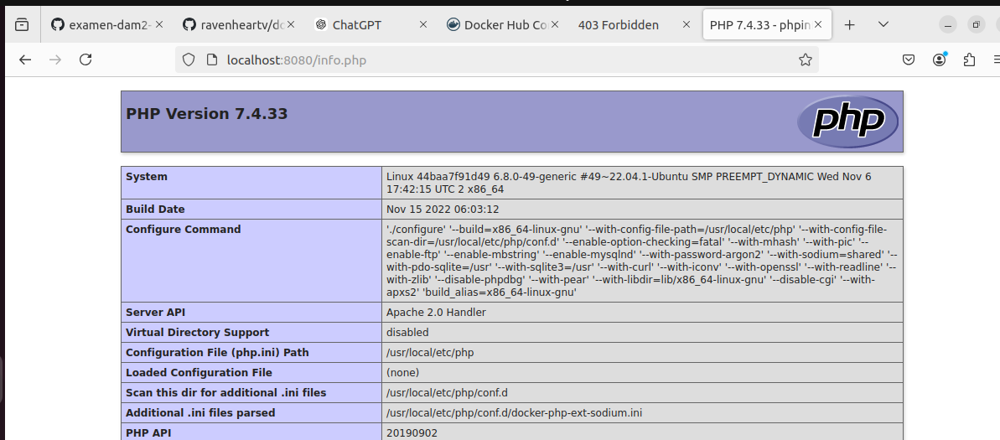
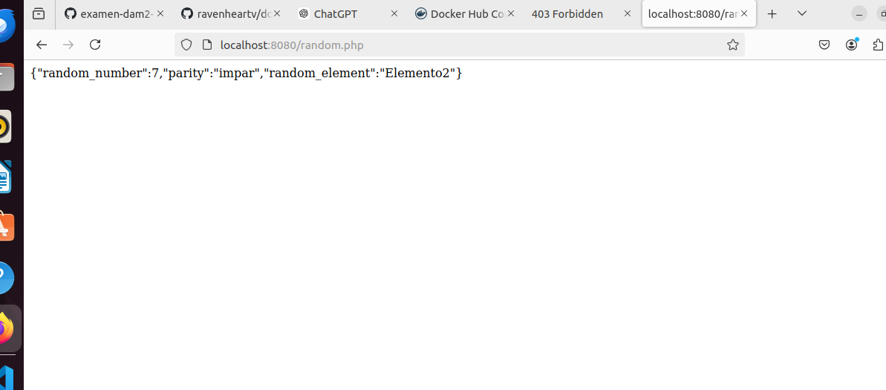

## SPRINT 1

iniciamos el repositorio e iniciamos sesion en docker


## SPRINT 2
 creamos la carpeta de apache con dockerfile dentro.

```
mkdir apache
cd apache
touch Dockerfile
```

arrancamos y lanzamos la imagen

```
docker build -t apache-server .
docker run -d -p 8080:80 apache-server
```


## SPRINT 3

copio la carpeta y le cambio el nombre

```
cp -r apache apache-php
cd apache-php
```
modifico el docker file para que funcione con php

FROM php:7.4-apache
COPY ./index.php /var/www/html/

usamos los mismos comandos para runear y...

```
docker build -t apache-php-server .
docker run -d -p 8080:80 apache-php-server
```


## SPRINT 4 

copiamos la carpeta de nuevo y añadimos dos archivos uno de ellos info.php

```
<?php
phpinfo();
?>
```

y el otro random.php

```
<?php
$number = rand(1, 100);
$elements = ["Elemento1", "Elemento2", "Elemento3", "Elemento4", "Elemento5"];
echo json_encode([
    "random_number" => $number,
    "parity" => $number % 2 === 0 ? "par" : "impar",
    "random_element" => $elements[array_rand($elements)]
]);
?>
```

funcionando:





## SPRINT 5

Crea una carpeta apache-php-mysql y dentro un archivo docker-compose.yml:

```
version: '3.8'
services:
  web:
    build: ./apache-php
    ports:
      - "8080:80"
  db:
    image: mysql:5.7
    environment:
      MYSQL_ROOT_PASSWORD: root
      MYSQL_DATABASE: examen
    volumes:
      - db_data:/var/lib/mysql
volumes:
  db_data:
```

Creo un archivo init.sql:

```
CREATE DATABASE examen;
USE examen;
CREATE TABLE users (
    id INT AUTO_INCREMENT PRIMARY KEY,
    name VARCHAR(100),
    password VARCHAR(100)
);
INSERT INTO users (name, password) VALUES ('user1', 'pass1'), ('user2', 'pass2');
```

Copio la carpeta apache-php dentro de apache-php-mysql.

Modifico index.php para conectar a MySQL:

```
<?php
$conn = new mysqli('db', 'root', 'root', 'examen');
if ($conn->connect_error) {
    die("Conexión fallida: " . $conn->connect_error);
}
echo "Conexión exitosa a la base de datos.";
?>
```

Crea un archivo users.php:
```
<?php
$conn = new mysqli('db', 'root', 'root', 'examen');
$result = $conn->query("SELECT * FROM users");
while ($row = $result->fetch_assoc()) {
    echo "<p>ID: {$row['id']} - Name: {$row['name']}</p>";
}
?>
```
Construye y lanza el entorno completo:

docker-compose up --build